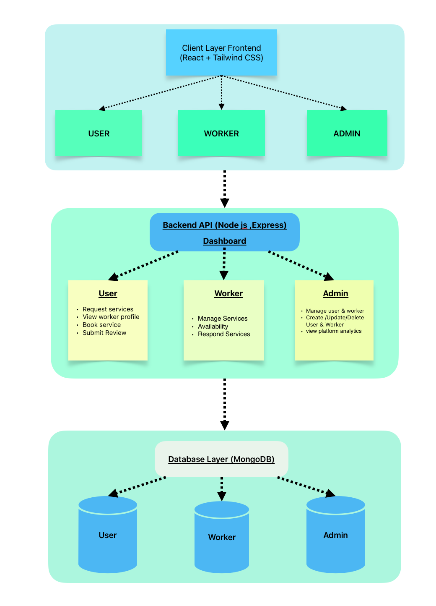

# SevaHub 
Team Leader: Ankit Bhandari
Team Members: 
1.Vaibhav pant
2.Vineet juyal
3.Nishant Rajput

an online platform for multiple services 
### Problem Statement
 * In today's fast-paced world, people often struggle to find reliable and efficient services for their daily needs. Whether it's finding a trustworthy plumber, a skilled tutor, or a reliable delivery service, the process can be time-consuming and frustrating.

### Solution
 * SevaHub aims to address this problem by providing a comprehensive online platform that connects service providers with customers in a seamless and efficient manner. The platform will offer a wide range of services, including home repairs, tutoring, delivery services, and more.

### Features
1. **User-Friendly Interface**: SevaHub will have an intuitive and user-friendly interface
2. **Service Categories**: The platform will categorize services for easy navigation, allowing users to quickly find the services they need.
3. **Verified Service Providers**: SevaHub will implement a verification process to ensure that
service providers are trustworthy and reliable, giving customers peace of mind when hiring services.
4. **Customer Reviews and Ratings**: Users will be able to leave reviews and ratings for service providers, helping others make informed decisions when choosing services.
5. **Secure Payment System**: SevaHub will integrate a secure payment system to facilitate transactions between customers and service providers, ensuring a safe and convenient payment process.
6. **Real-Time Tracking**: For services like delivery, SevaHub will offer real-time tracking, allowing customers to monitor the status of their orders and deliveries.

### System Architecture

